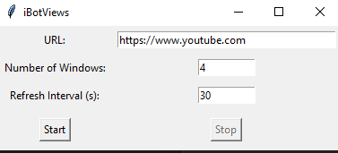

# iBotViews

iBotViews is a Python-based automation tool that helps simulate web traffic by managing multiple browser instances. It can open a specified URL in multiple browser tabs/windows and automatically refresh them at defined intervals.

> ⚠️ **Disclaimer**: This tool is for educational purposes only. Using automated tools to artificially inflate view counts may violate the terms of service of many websites. Please use responsibly and in accordance with website policies.

## 🌟 Features

- User-friendly GUI interface
- Open multiple browser instances simultaneously
- Configurable refresh intervals
- Support for multiple browsers (Chrome, Firefox, Safari)
- Automatic browser cleanup on exit
- Cross-platform compatibility (Windows, macOS, Linux)

## 🛠️ Available Versions

1. **Basic Version** (`ViewBot.py`): Simple command-line implementation
2. **Selenium Version** (`ViewBot_Selenium.py`): More robust implementation using Selenium WebDriver (Not working)
3. **GUI Version** (`iBotViews.py`): Full-featured GUI application with additional controls

## 📋 Requirements

- Python 3.6+
- Required Python packages:
  ```
  pyautogui
  psutil
  tkinter (usually comes with Python)
  selenium (for Selenium version)
  ```

## 🚀 Installation

1. Clone the repository:
   ```bash
   git clone https://github.com/yourusername/iBotViews.git
   cd iBotViews
   ```

2. Install required packages:
   ```bash
   pip install -r requirements.txt
   ```

## 💻 Usage

### GUI Version (Recommended)
Run the GUI version for the most user-friendly experience:
```bash
python iBotViews.py
```



1. Enter the target URL
2. Specify the number of windows/tabs
3. Set the refresh interval (in seconds)
4. Click "Start" to begin
5. Use "Stop" to close all browser instances

### Command Line Version
```bash
python ViewBot.py <url> <number_of_windows> <refresh_interval>
```

Example:
```bash
python ViewBot.py https://www.youtube.com/watch?v=example 5 30
```


## ⚙️ Configuration

- **URL**: The webpage you want to open (e.g., https://www.youtube.com)
- **Number of Windows**: How many browser instances to open (recommended: 2-10)
- **Refresh Interval**: Time between refreshes in seconds (recommended: 30+)

## 🤝 Contributing

Contributions are welcome! Please feel free to submit a Pull Request. For major changes, please open an issue first to discuss what you would like to change.

1. Fork the repository
2. Create your feature branch (`git checkout -b feature/AmazingFeature`)
3. Commit your changes (`git commit -m 'Add some AmazingFeature'`)
4. Push to the branch (`git push origin feature/AmazingFeature`)
5. Open a Pull Request

## 📝 Missing Features/TODO

- [ ] Add support for scheduled operations
- [ ] Implement better error handling and recovery
- [ ] Add support for opening incognito windows
- [ ] Add support for opening tabs instead of windows
- [ ] Add support for opening multiple instances of the same browser


## ⚠️ Known Issues

- High memory usage with large number of windows
- Potential browser detection on some websites
- Limited support for some web platforms

## 📄 License

This project is licensed under the MIT License - see the [LICENSE](LICENSE) file for details.

## 👥 Authors

- Yarooq (@YarooqH)
